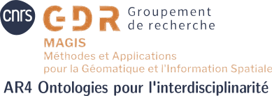

# Ontologies pour l'interdisciplinarité

## Contact

Action de recherche du [GdR CNRS MAGIS](https://gdr-magis.cnrs.fr/)

Si vous souhaitez participez à cette action de recherche, vous pouvez contacter :
- [Eric](mailto:eric.masson@univ-lille.fr)
- [Damien](mailto:damien.arvor@gmail.com)
- [Raphaelle](mailto:raphaelle.krummeich@univ-rouen.fr)
- et/ou [vous inscrire](
https://groupes.renater.fr/sympa/subscribe/ontodisciplinarite) à la liste de diffusion ontodisciplinarite@groupes.renater.fr

## Activités

<!-- - [Liste des webinaires et accès aux présentations](https://github.com/MAGISAR4/ontologies_4_interdisciplinarity/tree/main/webinaires) -->

### Ontologies géospatiales: progrès et challenges ouverts 

- Présentateur : Christophe Claramunt
- Date : Mercredi 30 mars 2022 - 14h-16h
- [PDF](https://github.com/MAGISAR4/project/blob/main/webinaires/GeoSpatialOntologiesCC.pdf)

### Annotation sémantique d'image médicales - les projets CYTOMINE et BigPicture

- Présentateur : Raphael Marée
- Date : 27 septembre 2022, 13h30-15h30
- [PDF](https://github.com/MAGISAR4/project/blob/main/webinaires/Cytomine_GIS_Sept2022.pdf)

### Incorporating domain knowledge in the analysis of remote sensing data

- Présentatrice : Mariana Belgiu
- Date : Vendredi 20 janvier 2023, 13h30-15h30
- [PDF](https://github.com/MAGISAR4/ontologies_4_interdisciplinarity/blob/main/webinaires/GeoSpatialOntologiesCC.pdf)

### L'interdisciplinarité: taxonomie, flou et interalogie

- Présentatrice : Deborah Nourrit
- Date : Vendredi 26 mai 2023, 13h-15h

### Atelier des 28 & 29 novembre 2022 

En présentiel à la MSH Val de Loire & distanciel via Zoom. **28 et 29 novembre 2022**
co-organisé avec le GT WebSem de la MSH Val de Loire et le GT SeWin du RTR DIAMS
**Thème : CIDOC-CRM, une ontologie pivot pour l'interdisciplinarité ?**

Télécharger le programme [en ligne ici](https://github.com/MAGISAR4/ontologies_4_interdisciplinarity/raw/main/ateliers/Journ%C3%A9es_ontologies_websemantique_28-29Nov2022.pdf)

#### Programme

- Lundi 28 novembre 2022 

    - 10h-12h - Groupe de Travail Web Sémantique MSH Val de Loire/Huma-Num  
        - Projet européen 4CH ∙ Béatrice Markhoff  
        - Web sémantique et ontologie pour une cartographie des compétences du patrimoine culturel : Yannick Duthé et Béatrice Markhoff  
    - 14h-17h - AP Ontologies pour l'interdisciplinarité du GdR MAGIS (hybride)   
        - Thérèse Libourel, présentation de WordNet  
        - Olivier Marlet, présentation du CIDOC-CRM et Onto Match Game  

- mardi 29 novembre 2022

    - 9h-12h30 - GT WebSem de la MSH Val de Loire + AP Ontologies pour l'interdisciplinarité du GdR MAGIS + GT SeWin du RTR DIAMS (hybride)  
        - Emilio Sanfilippo, Towards a formal model for scholarly interpretations  
        - Béatrice Markhoff, Rôle et manifestations des terminologies dans le Web sémantique ∙ 
        - Thomas Francart, SPANATURAL, montrez les graphes de connaissances à vos utilisateurs  
        - Florian Hivert, OpenArchaeo un SPARNATURAL destiné à l’archéologie et à ses chercheurs  
    - 14h-17h - GT SeWin du RTR DIAMS  
        - Béatrice Markhoff, Ontologie de jumeaux numériques patrimoniaux  
        - Yannick Duthé, Cartographie des compétences du patrimoine culturel  
        - Christelle Loiselet, Actions pour la sémantisation des données au BRGM  
        - Imad Laouici, Structuration de la connaissance en géologie structurale  
        - Christine Le-Bas, Annotation sémantique des données de l’INRAe Orléans  

## Présentation de l'AR

Lors des réunions ouvertes des assises de Juin 2020 du GdR CNRS MAGIS, les participants nombreux (une trentaine) ont exprimé leur intérêt pour le sujet traité par l’action prospective "Ontologies et dynamiques spatiales" entre 2016 et 2021. Ce projet qui est renouvellé comme une Action de Recherche (AR) du GdR CNRS MAGIS est ouvert à de nouvelles participations.
 
### Objectifs scientifiques
 
Alors que les Sciences de l’Information Géographique (GISciences) évoluent rapidement, s’appuyant notamment sur l’avènement des techniques d’intelligence artificielle, force est de constater que les méthodes « *data-driven* » (e.g. apprentissage automatisé) tendent à s’imposer très largement face aux méthodes « *knowledge-driven* ». Ainsi, par exemple dans le domaine de la télédétection, bien que l’intérêt pour les ontologies soit ancien, celles-ci n’ont pas rencontré le succès escompté tandis que d’autres approches plus récentes, telles que l’apprentissage automatisé par réseaux neuronaux profonds (*Deep Learning*), connaissent un engouement sans précédent.
 
Fort de ce constat, il convient de se questionner sur le rôle que les ontologies sont amenées à jouer dans les GISciences. D’une part, la construction d’ontologies dans un contexte interdisciplinaire prend du temps et, d’autre part, l’application d’ontologies doit faire face à des problèmes techniques de calculabilité et d’expressivité des langages ontologiques qui expliquent le manque relatif de maturité des technologies sous-jacentes (Claramunt, 2020). L’intérêt continu pour les ontologies perdure cependant parce qu’il est essentiel de maintenir et de structurer les connaissances au cœur de la science. 

Dans le contexte des GISciences les connaissances des chercheurs mises en ɶuvre dans les projets sont hétérogènes (traduisant des perceptions diverses). L’écueil principal est d’éviter les interprétations trop “simplistes” dans une approche de type “plus petit dénominateur commun”. 
Dans le domaine philosophique, un travail de fond est ainsi en regain (Richard et al., 2010). Nous souhaiterions que nos activités nouent ou renouent avec de tels travaux d'ordre plus général sur les ontologies (Armstrong, 1997 ; Heller, 1990 ; Munn et Smith, 2008 ; Arp et al., 2015) afin de mieux les assimiler et les intégrer dans les approches que développe la communauté MAGIS. Ce qui demande d’étendre la connaissance des ontologies en général et celles, existantes, qui contribuent plus directement par leurs apports à l’effort de recherche dans les GISciences.
De notre point de vue, les questions scientifiques interdisciplinaires que nous traitons ont grandement à gagner à travers cette ouverture à ce pan de connaissance. En effet, les ontologies sont de nature à favoriser l’interdisciplinarité dans les GISciences par leur potentiel à :

- agréger et organiser des connaissances très diverses,
- assurer l’interopérabilité des données et des outils.

Mais ce potentiel doit être confirmé, et pour ce faire, il est essentiel de renforcer les interactions entre les producteurs d’ontologies et les consommateurs d’ontologies.

 Ainsi, l’AR choisit de proposer une réflexion scientifique selon deux grands axes :
 
1. Agrégation et formalisation de connaissances interdisciplinaires dans les ontologies

Il s’agit ici d’évaluer comment construire des ontologies formalisées et opérables à partir de modèles de connaissance. Les GISciences ont la particularité de s’appuyer sur de nombreux concepts vagues et ambigus (Bennett, 2002), ce qui rend les méthodes Top-Down de construction d’ontologies, basées sur la recherche d’un consensus interdisciplinaire, difficiles à mettre en œuvre. Ainsi, certains auteurs prônent des approches bottom-up visant à agréger de la connaissance à partir de nombreuses ontologies applicatives développées localement (Janowicz, 2012).

2. De la donnée à la connaissance : quel rôle pour les ontologies ?

La représentation de connaissance mais aussi les raisonnements (George, 1997) liant les corpus sont essentiels à la construction et à l'usage d'ontologies. Mais la question de l’interprétabilité des résultats issus des approches data-driven émerge fortement (Small, 2020) et les ontologies, de par leur capacité à transformer de la connaissance numérique en connaissance symbolique, pourraient apporter des éléments de réponse. Cependant le cheminement aboutissant à l'interprétation est certainement le moins connu (Bouleau, 2017). Il s’agit ici d’évaluer comment exploiter les ontologies pour guider le traitement et l’interprétation des données afin de produire des résultats interprétables et utiles.

L’AR se positionne donc comme un espace favorisant la mise en relation entre experts utilisant ou souhaitant utiliser des ontologies pour répondre à des questions interdisciplinaires qui concernent les dynamiques spatiales et temporelles dans les territoires habités ou sous l’influence de l’Homme. L’objectif est d’aider à produire une science centrée sur l’utilisateur et non pilotée par les données (Krivine, 2018). Si les ontologies actuelles poussent (*“push”*) des connaissances déjà structurées elles peuvent aussi gagner en nouvelles connaissances et en interopérabilité grâce aux usagers (*“pull”*) sous la forme, par exemple, d’un retour sur expérience.

### Programme d’actions

La dynamique de cette réflexion sera entretenue à travers des visioconférences, deux fois l’an au moins, où nous souhaitons inviter des experts hors de la communauté MAGIS ayant mobilisé des ontologies avec succès. Lors de ces espaces de débats et d’échanges, nous souhaitons inviter des membres des autres ARs à faire un exposé pour qu’ils viennent dire le cas échéant comment et pourquoi ils ont mobilisé des ontologies (AR humanités spatialisées, AR observatoires), quels sont les problèmes actuels rencontrés en termes de calculabilité, expressivité (AR graphe de connaissance), etc.

Ces visios auront pour objectif de préparer l’appel à communication et la programmation d’ateliers en présentiel, chaque deux ans, où nous mobiliserons la communauté MAGIS et plus largement pour illustrer les deux questions ciblées, d’abord la première, puis la seconde.

La dernière année, nous travaillerons sur la production d’un ouvrage synthétisant les connaissances autour de l’usage et la production d’ontologies pour l’étude de l’espace et de ses évolutions.

 L’espace de cette réflexion sera virtualisé, et mis en ligne sur une page Web afin de partager et mobiliser une large audience autour de ces questions.

 
### Bibliographie
 
  Arp, R., Smith, B., & Spear, A. D. (2015). Building ontologies with Basic Formal Ontology. Massachusetts Institute of Technology.  
  Bennett, B. (2001). What Is a Forest? on the Vagueness of Certain Geographic Concepts. Topoi, 20(2), 189–201. https://doi.org/10.1023/A:1017965025666  
  Bouleau, N. (2017). Penser l’éventuel. Editions Quae. https://doi.org/10.3917/quae.boule.2017.01  
  Claramunt, C. (2020). Ontologies for geospatial information: Progress and challenges ahead. Journal of Spatial Information Science, 20, 35–41. https://doi.org/10.5311/JOSIS.2020.20.666  
  George, C. (1997). Polymorphisme du raisonnement humain. Presses Universitaires de France. https://doi.org/10.3917/puf.georg.1997.01  
  Heller, M. (1990). The ontology of physical objects: Four-dimensional hunks of matter. Cambridge University Press. https://doi.org/10.1017/CBO9781139166409  
  Hochberg, H. (1999). Review of A World of States of Affairs. Noûs, 33(3), 473–495. https://www.jstor.org/stable/2671997  
  Janowicz, K. (2012). Observation‐Driven Geo‐Ontology Engineering. Transactions in GIS, 16(3), 351–374. https://doi.org/10.1111/j.1467-9671.2012.01342.x  
  Krivine, H., & Ameisen, J. C. (2018). Comprendre sans prévoir, prévoir sans comprendre. Cassini.  
  Munn, K., & Smith, B. (Eds.). (2008). Applied Ontology: An Introduction. DE GRUYTER. https://doi.org/10.1515/9783110324860  
  Richard, S. (2010). Analyse et ontologie: le renouveau de la métaphysique dans la tradition analytique. J. Vrin.  
  Small, C. (2021). Grand Challenges in Remote Sensing Image Analysis and Classification. Frontiers in Remote Sensing, 1, 605220. https://doi.org/10.3389/frsen.2020.605220  
